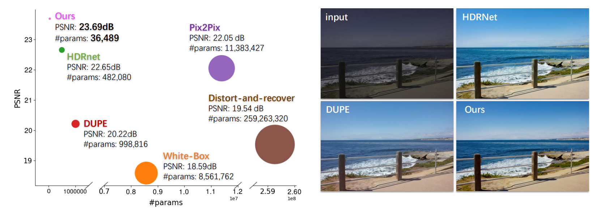

# Conditional Sequential Modulation for Efficient Global Image Retouching [Paper Link](http://www.ecva.net/papers/eccv_2020/papers_ECCV/papers/123580664.pdf)
By Jingwen He*, Yihao Liu*, [Yu Qiao](http://mmlab.siat.ac.cn/yuqiao/), and [Chao Dong](https://scholar.google.com.hk/citations?user=OSDCB0UAAAAJ&hl=en) (* indicates equal contribution)


<p align="center"> 
  
</p>
<b>Left</b>: Compared with existing state-of-the-art methods, our method achieves
superior performance with extremely few parameters (1/13 of HDRNet and 1/250
of White-Box). The diameter of the circle represents the amount of trainable
parameters. <b>Right</b>: Image retouching examples. 


<p align="center"> 
  
  

</p>
The first row shows smooth transition effects between different styles (expert A
to B) by image interpolation. In the second row, we use image interpolation to control
the retouching strength from input image to the automatic retouched result. We denote
the interpolation coefficient α for each image.

### BibTex
    @article{he2020conditional,
      title={Conditional Sequential Modulation for Efficient Global Image Retouching},
      author={He, Jingwen and Liu, Yihao and Qiao, Yu and Dong, Chao},
      journal={arXiv preprint arXiv:2009.10390},
      year={2020}
    }


## Dependencies and Installation

- Python 3 (Recommend to use [Anaconda](https://www.anaconda.com/download/#linux))
- [PyTorch >= 1.0](https://pytorch.org/)
- NVIDIA GPU + [CUDA](https://developer.nvidia.com/cuda-downloads)
- Python packages: `pip install numpy opencv-python lmdb pyyaml`
- TensorBoard:
  - PyTorch >= 1.1: `pip install tb-nightly future`
  - PyTorch == 1.0: `pip install tensorboardX`


## Datasets

Here, we provide the preprocessed datasets: [MIT-Adobe FiveK dataset](https://drive.google.com/drive/folders/1qrGLFzW7RBlBO1FqgrLPrq9p2_p11ZFs?usp=sharing), which contains both training pairs and testing pairs.
- training pairs: {GT: expert_C_train; Input: raw_input_train}
- testing pairs: {GT: expert_C_test; Input: raw_input_test}

## How to Test
1. Modify the configuration file [`options/test/test_Enhance.yml`](codes/options/test/test_Enhance.yml). e.g., `dataroot_GT`, `dataroot_LQ`, and `pretrain_model_G`.
(We provide a pretrained model in [`experiments/pretrain_models/csrnet.pth`](experiments/pretrain_models/))
1. Run command:
```c++
python test_CSRNet.py -opt options/test/test_Enhance.yml
```
1. Modify the python file [`calculate_metrics.py`](codes/calculate_metrics.py): `input_path`, `GT_path` (Line 139, 140). Then run:
```c++
python calculate_metrics.py
```

## How to Train
1. Modify the configuration file [`options/train/train_Enhance.yml`](codes/options/train/train_Enhance.yml). e.g., `dataroot_GT`, `dataroot_LQ`.
1. Run command:
```c++
python train.py -opt options/train/train_Enhance.yml
```

## Acknowledgement

- This code is based on [mmsr](https://github.com/open-mmlab/mmsr). 
- Thanks Yihao Liu for part of this work.
